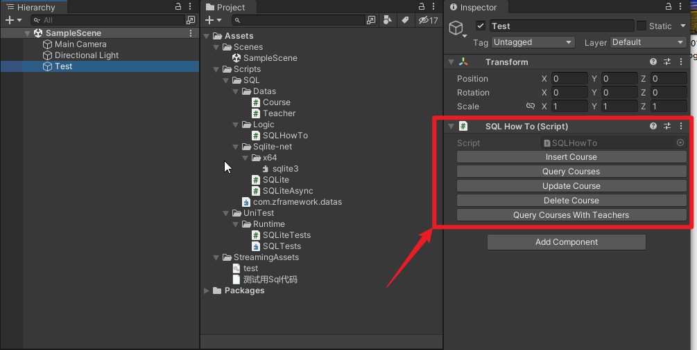
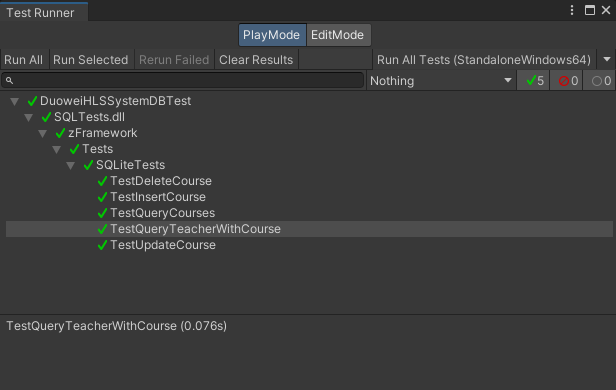

# SQLite-For-Unity

这个项目是一个测试项目，用于测试 SQLite 在 Unity 中的使用。

This project is a test project for testing SQLite in Unity.

# 开发环境 / Development environment
Unity 2021.3.16f1

# 测试简介 / Test introduction
1. 测试 SQLite-net 在 Unity中的 ORM 增删改查的使用方式方法。

	Test the usage method of SQLite-net's ORM CRUD in Unity.

2. 脚本 SQLHowTo.cs 用于在编辑器下测试，运行后点击此脚本上的 Inspector 面板上的按钮即可 ，提供对 Courses（课程）表的增删改查，如下图所示

	The script SQLHowTo.cs is used for testing under the editor. After running, click the button on the Inspector panel of this script to provide CRUD for the Courses table, as shown in the figure below

3. 工程同样配备了测试用例，位于 Assets/Scripts/UniTest/Runtime/SQLiteTests.cs, 通过菜单栏 Window/General/Test Runner 打开测试用例窗口，点击 Run All Tests 即可运行测试用例。

	The project is also equipped with test cases, located in Assets/Scripts/UniTest/Runtime/SQLiteTests.cs, open the test case window through the menu bar Window/General/Test Runner, and click Run All to run the test case.

# 使用方法 / How to use

clone 本项目后，使用 对应版本的 Unity 开启即可。

After cloning this project, use the corresponding version of Unity to open it.

# 参考链接 / Reference

SQLite client and ORM for .NET https://github.com/praeclarum/sqlite-net

加密版本的 sqlite https://github.com/sqlcipher/sqlcipher

db 数据库浏览器 https://github.com/sqlitebrowser/sqlitebrowser

SQLite 官方网站 https://www.sqlite.org/index.html